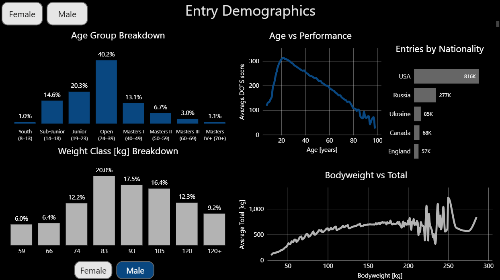
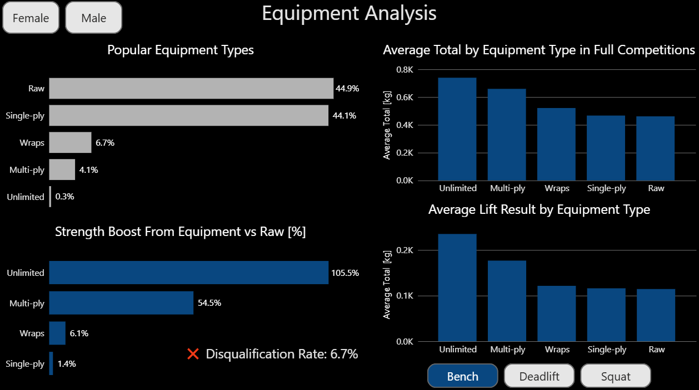

# Powerlifting Analysis — SQL + Power BI

## Project Summary

A comprehensive analysis of athlete performance, equipment impact, and global participation trends using the OpenPowerlifting dataset.

- Deliverable: **Power BI dashboard** (6 pages) + auditable **SQL/DAX logic**
- Model: **SQL star schema** (fact + dimensions) validated with SQL sanity checks (row counts, null checks, distribution checks)
- Metrics based on data state as of: **January 6, 2024**

[Dataset](https://www.kaggle.com/datasets/open-powerlifting/powerlifting-database) | [CSV Field Descriptions](https://openpowerlifting.gitlab.io/opl-csv/bulk-csv-docs.html) | [Interactive Power BI Dashboard](https://app.powerbi.com/view?r=eyJrIjoiOGM4Y2I5ZDUtY2RjYS00ODBjLThhYWQtZjI2YzllMzNmNmE5IiwidCI6ImRmODY3OWNkLWE4MGUtNDVkOC05OWFjLWM4M2VkN2ZmOTVhMCJ9&pageName=4e52e86104a6a09054c9) | [SQL Code](./sql) | [DAX Measures](./dax)

## Definitions (used throughout the report)

- **Meet entry** = one row in `powerlifting_facts` (one lifter’s result in one meet)
- **Unique lifter** = distinct `lifter_id` from `dim_lifter`, where lifters are deduplicated using **OpenPowerlifting `Name` (including `#` suffix when present) + Sex**. Country is treated as auxiliary metadata
- **Valid result (default)** = `total IS NOT NULL` (entries with a recorded total)
- **No-total** = `total IS NULL` (no total recorded; typically bomb-out / disqualification proxy)
- **Full competition** = `total IS NOT NULL` and `squat`, `bench`, `deadlift` are all present (used only where explicitly stated)

## Data Preparation & Modeling

This project separates logic into two layers:
- **SQL** for cleaning, modeling (star schema), and validation checks
- **DAX** for slicer-driven measures (percentiles, dynamic comparisons) inside Power BI

Before analysis, the raw OpenPowerlifting data.csv file was cleaned and modeled using SQL. Key steps included:

- Filtering out **invalid or unrealistic entries**, such as:
  - Lifters younger than 8 years
  - Bodyweight below 30 kg
  - Ambiguous sex entries (e.g., 'Mx')
- Standardizing key columns:
  - Converted 'M'/'F' → 'Male'/'Female'
  - Replaced missing country info with `'Unknown'`
- Deriving analytical fields:
  - **Age groups** and **weight classes** (IPF-style buckets used for analysis)
  - **First place**, **tested status**, **lift combinations**, and **single-lift types**
- Modeling the data using a **star schema**:
  - `dim_lifter` and `dim_meet` as dimension tables
  - `powerlifting_facts` as the central fact table
- Creating **indexes** for efficient querying
- Populating tables using joins on stable keys (e.g., lifters deduplicated by OpenPowerlifting `name` + `sex`; country treated as auxiliary)

> [00_setup_data.sql](sql/00_setup_data.sql)

## Men vs Women

*This page explores participation trends in global powerlifting based on meet entries — including sex distribution, average lift totals, and event formats. It highlights how men and women differ in performance patterns, specialization, and event type preferences.*

### Key insights

- **Sex Distribution**
  - Men dominate participation **(75.3%)**, but women now account for nearly 1 in 4 entries **(24.7%)** — reflecting growing inclusivity in a once male-dominated sport

- **Average Total**
  - Men lift **540 kg** on average vs **305 kg** for women — a difference aligned with physiological factors, yet still showcasing impressive female performance

- **Average Lifts (entries with recorded total)**
  - Averages are computed on entries where `total` is recorded; individual lift averages ignore missing lift values
  - The biggest gap is in **bench press** (women <50% of male avg), likely due to upper body strength. **Squat** and **deadlift** gaps are smaller but notable

- **Lift Contribution (based on average lifts within total-recorded entries)**
  - Contribution is derived from average lift values within entries that have a recorded `total` (not restricted to full SBD unless explicitly stated)
  - **Bench press** contributes the least to total, while **deadlift** dominates. **Bench press** is slightly more important for men, **deadlift** for women — possibly reflecting biological differences

- **Lift Combination Events**
  - About **75%** of entries are traditional **3-lift** meets. **Single-lift** events are common too — especially for men (**31.4%** vs **22.2%** in women. **Two-lift** formats are rare (**2.2%**)

- **Single-lift Event Popularity**
  - **Bench press** dominates single-lift meets (>70%), followed by **deadlift**. Men prefer bench-only, while women lean more toward deadlift — highlighting differing specialization trends

> [01_men_vs_women.sql](sql/01_men_vs_women.sql) | [01_men_vs_women.md](dax/01_men_vs_women.md)

---

## Entry Demographics

### Key insights

- **Entries by Nationality**
  - The **USA** dominates entry volume, far ahead of other nations — reflecting the maturity and infrastructure of American powerlifting federations

- **Age Group Breakdown**
  - The **Open (24–39)** category is by far the most common. Youth and Masters groups are present but less represented, with participation tapering at both extremes

- **Weight Class Breakdown**
  - The most common class is **83 kg for men** and **63 kg for women**. Women’s entries are more evenly spread across weight classes compared to men

- **Age vs Performance**
  - Peak average DOTS scores — a normalized strength metric — occur between ages **20–26**, suggesting this is the **prime performance window** for most lifters
  - However, many of the **world’s top competitors** remain highly competitive well into their **30s and 40s**, highlighting the impact of training experience and longevity in strength sports

- **Bodyweight vs Total (full competitions only)**
  - For both sexes, average total **rises steadily with bodyweight** up to **~140 kg (men)** and **~130 kg (women)**
  - Beyond that, the trend becomes **erratic**, with sharp ups and downs — likely due to smaller sample sizes and shifting strength-to-mass dynamics
  - Interestingly, **some of the highest all-time totals** are achieved in these extreme bodyweight categories

> [02_entry_demographics.sql](sql/02_entry_demographics.sql) | [02_entry_demographics.md](dax/02_entry_demographics.md)

---

## Competition Landscape

*This page analyzes structural patterns of the powerlifting ecosystem — including how often athletes return to compete, how prevalent drug-testing is, and which federations dominate the scene. It also tracks the global growth of the sport over time, highlights the most popular competitions by entry volume, and shows which countries host the largest number of meets.*

### Key insights

- **Lifter Retention (by unique lifters)**
  - Unique lifters are nearly evenly split between those who competed only once (**47.9%**) and those who returned for multiple meets (**52.1%**) — indicating strong retention and long-term engagement within the sport

- **Drug Testing Share**
  - About **73.6%** of entries come from **tested federations**, while **26.4%** are untested — showing that drug-tested competitions make up the majority of the global powerlifting scene

- **Meet Entries Over Time**
  - Participation remained low through the 1980s, then spiked between **1979 and 1986** — likely due to the emergence of early international federations and better historical data capture during that period
  - After a decline, meet entries began to rise again, followed by a sharp surge after **2009**, reflecting the sport’s global expansion
  - The pronounced drop in entries after **2019** aligns with widespread **COVID-19 cancellations and restrictions** across sports

- **Top Locations Worldwide**
  - Out of **47.4K recorded meets**, over **half** took place in the **USA (23.8K)** — followed by **Russia (3.9K)** and **Norway (2.9K)**
  - While competitions have been held in **122 countries**, the vast majority are concentrated in just a few regions
  - This reflects both the sport’s **broad international reach** and its **heavy localization** in certain powerlifting hubs

- **Most Popular Federations**
  - The top federations by entry volume are **THSPA (378K)**, **USAPL (282K)**, and **USPA (190K)** — suggesting the strong influence of U.S.-based organizations

- **Most Popular Competitions**
  - **World Championships (76K entries)** top the list, followed by **European Championships (28K)** and **World Cup (19K)** — highlighting the global prestige of these events

> [03_competition_landscape.sql](sql/03_competition_landscape.sql) | [03_competition_landscape.md](dax/03_competition_landscape.md)

---

## Equipment Analysis

*This page compares lifting performance across different equipment categories — such as Raw, Wraps, and Multi-ply — while also examining disqualification rates and the popularity of each gear type. It highlights how equipment choices influence average results and overall competitiveness.*

Note: *Share of entries with missing `total` (`total IS NULL`) — used as a proxy for no-total outcomes (bomb-out / DQ)*

### Key insights

- **Popular Equipment Types**
  - **Raw (44.9%)** and **Single-ply (44.1%)** together account for nearly **90% of all entries**
  - More advanced equipment like **Wraps (6.7%)**, **Multi-ply (4.1%)**, and **Unlimited (0.3%)** is used far less frequently

- **Strength Boost from Equipment vs Raw**
  - **Bench press** sees the most dramatic impact: **Unlimited gear** offers a **+105.5% boost**, while **Multi-ply** adds **+54.5%**
  - In **deadlift**, gains are much smaller: **Unlimited +22.2%**, **Multi-ply +21.3%**
  - **Squat** falls in between: **Unlimited +74.6%**, **Multi-ply +57.4%**
  - Wraps and Single-ply offer only modest gains — and in some cases, almost none or even negative effect (e.g., **Single-ply deadlift: −4.6%**)

- **Average Lift Results by Equipment Type**
  - Equipment consistently enhances average lift results, but the **effect size varies by lift**
  - **Bench press** shows the largest differences between gear types
  - **Deadlift** is the least affected
  - **Squat** results reflect a middle ground — strongly boosted by higher-tier equipment

- **Disqualification Rate by Equipment Type**
    - **Raw: 3.9%**
    - **Multi-ply: 4.1%**
    - **Wraps: 4.9%**
    - **Unlimited: 8.5%**
    - **Single-ply: 9.4%**

- **Average Total by Equipment Type in Full Competitions**
  - Overall total performance increases with the level of equipment used
  - **Unlimited and Multi-ply lifters** record the highest totals, followed by **Wraps**, **Single-ply**, and **Raw** — confirming the gear’s impact on output

> [04_equipment_analysis.sql](sql/04_equipment_analysis.sql) | [04_equipment_analysis.md](dax/04_equipment_analysis.md)

---

## Hall of Fame

*This page celebrates the top performers in powerlifting history. It highlights athletes with the highest totals, best individual lifts, most wins, and most meet appearances — offering a leaderboard-style perspective on elite performance.*

Note: *Leaderboards are based on `lifter_id` (lifter deduplication uses OpenPowerlifting `name` + `sex`, including `#` suffix when present); results may reflect merged identities in rare edge cases.*

### Key insights

- **Top Lifters by Total**
  - The heaviest totals exceed **1400 kg (men)** and **930 kg (women)** — led by legends like Dave Hoff and Leah Reichman
  - In the Raw category, best totals are still staggering: Ray Williams tops men with **1113 kg**, while Tamara Walcott leads women with **721 kg**

- **Best Individual Lifts**
  - Jimmy Kolb’s **636 kg bench press**, Danny Grigsby’s **488 kg deadlift**, and Nathan Baptist’s **595 kg squat** stand among the most jaw-dropping feats of strength ever recorded. On the women’s side, Leah Reichman’s **433 kg squat**, Becca Swanson’s **315 kg deadlift**, and Ashleigh Hoeta’s **318 kg bench press** push the boundaries of performance
  - In the Raw divisions, Ray Williams leads the men’s **squat** with **490 kg**, while Danny Grigsby and Spencer Mather dominate **deadlift (488 kg)** and **bench press (455 kg)**, respectively. For the women, Brittany Schlater **squats 281 kg**, Tamara Walcott **deadlifts 285 kg**, and Maria Mersberg **bench press 220 kg** — showing that elite strength is equally present without supportive gear

- **Most Wins**
  - Magomedamin Israpilov has a staggering **296 wins**, closely followed by Evgeniy Svoboda **(239)** and Gary Teeter **(228)**
  - Among women, Bonnie Aerts leads with **226 wins**, ahead of Judy Gedney **(172)**, and Heena Patel **(163)**

- **Most Competitions Entered**
  - Magomedamin Israpilov again tops with **411 entries** — reflecting extreme consistency and dedication
  - On the women’s side, Bonnie Aerts leads with **277 competitions**

> [05_hall_of_fame.sql](sql/05_hall_of_fame.sql)

---

## Personal Lift Calculator

*This page allows users to input their personal bests and compare them to the global powerlifting population — filtered by **sex**, **age group**, **weight class**, and optionally **country**. It offers percentile-based feedback and clear visual context for evaluating personal strength.*

### Key features

- **Lift Percentile Calculator**
  - Enter your **bench press**, **squat**, and **deadlift** to instantly see how your results compare to thousands of meet entries from lifters in the same demographic group
  - Percentile feedback highlights where you stand — from beginner level up to elite — based on real-world distribution data

- **Dynamic Visual Feedback**
  - Compare your lifts directly against group averages via clear bar charts
  - The visuals update in real-time based on your selected filters and inputs, showing if you're outperforming, matching, or trailing the typical lifter in your group

- **Progress Classification**
  - Each lift receives a badge — **Beginner**, **Intermediate**, **Skilled**, **Advanced**, or **Elite** — tied to your percentile bracket, offering an intuitive benchmark for goal setting and self-assessment

> [06_personal_lift_calculator.md](dax/06_personal_lift_calculator.md)

---

## Closing Thoughts

This project demonstrates an end-to-end workflow: **raw CSV → SQL star schema → validated metrics → interactive Power BI storytelling**.

Key skills applied:
- **Data modeling:** star schema design (fact/dimension separation, keys, indexing)
- **Data preparation:** filtering invalid records, standardization, derived analytical fields (age groups, weight classes, flags)
- **SQL analytics:** joins, CTEs, aggregations, window functions, validation queries
- **Power BI + DAX:** interactive visuals, slicer-driven measures, percentile-based benchmarking

---
